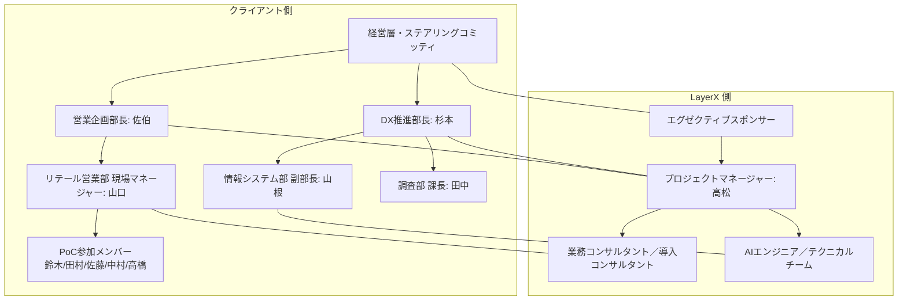

<!--
generated_at: 2026-01-14
generator: docgen skill
source_state:
  - project_state/project_charter.md (updated: 2026-01-22)
  - project_state/wbs.yaml (updated: 2026-01-22)
  - project_state/risks.yaml (updated: 2026-01-14)
  - project_state/decisions.yaml (updated: 2026-01-22)
parent_artifacts:
  - outputs/proposal_draft.md (updated: 2026-01-14)
template: templates/project_plan.md
-->

# AI Workforce PoC プロジェクト計画書

## リテール営業部門様向け

### 作成日: 2026年1月14日
### 作成者: LayerX

---

# **1. 表紙**

```
# AI Workforce PoC プロジェクト計画書
## リテール営業部門様向け
### 作成日: 2026/01/14
### 作成者: LayerX / AI Workforce PoCプロジェクト
```

---

# **2. 本計画書の目的・位置づけ**

## 2.1 目的

本計画書は、リテール営業部門におけるAI Workforce導入PoCの実行計画を定めるものです。提案業務の品質向上と生産性向上を実現するため、情報検索・市況整理・資料作成の3領域を対象としたPoCを段階的に実施します。

本計画書により、プロジェクトの全体像、スケジュール、体制、リスク対策を明確化し、関係者間での共通認識を確立します。

## 2.2 適用範囲

* **対象期間**: 2026年1月 〜 2026年4月（Phase1 PoC期間）
* **対象フェーズ**: Phase1（PoC設計・実行）、Phase2候補の検討
* **対象部門**: リテール営業部門（提案業務）

## 2.3 プロジェクトの背景・解決する課題

リテール営業部門の提案業務において、以下の課題が確認されています（提案書 2章参照）。

| 課題 | 現状 | 影響 |
|------|------|------|
| 情報検索が複数システム横断で非効率 | 1案件あたり30-60分の検索時間 | 生産性低下 |
| 過去提案が支店ローカルに埋もれている | ナレッジ活用不可 | 属人化の進行 |
| 市況レポートの量が多く若手が要点を掴めない | 市況理解の属人化 | 品質のばらつき |
| 資料作成が毎回スクラッチで時間がかかる | 1-2時間/提案の作成時間 | 生産性低下 |

これらの課題に対し、AI Workforceを活用した業務支援機能をPoCで検証し、効果を実証します。

---

# **3. プロジェクトのゴール・KGI/KPI**

## 3.1 ゴール（定性的）

1. **現場の生産性向上**: 検索・市況理解・資料作成の時間削減
2. **提案品質の底上げ**: 若手支援による市況理解・資料品質の向上
3. **ナレッジ活用の促進**: 調査部レポート・商品資料・FAQの統合検索
4. **現場の受容性確保**: 抵抗が少なく、現場が「使いたい」と思う機能の提供

## 3.2 KGI（最終的な成果指標）

| 指標 | 目標値 | 測定方法 |
|------|--------|----------|
| PoC参加者の満足度 | 4.0/5.0以上 | 週次アンケート（5段階評価） |
| Phase2移行の意思決定 | 継続決定 | PoC終了時のステアリングコミッティ |

## 3.3 KPI（プロジェクト進捗指標）

DEC-012に基づき、以下の5つのKPIを設定します。

| KPI | ベースライン | 目標値 | 測定方法 |
|-----|-------------|--------|----------|
| 1. 情報検索時間 | 40分/案件 | 20分/案件（50%削減） | PoC参加者の記録ログ分析 |
| 2. 市況理解度 | - | アンケート平均4.0/5.0以上 | 週次アンケート（5段階評価） |
| 3. 提案書作成時間 | 1時間/案件 | 30分/案件（50%削減） | PoC参加者の記録ログ分析 |
| 4. 利用率 | - | 週次80%以上 | システムログから自動集計 |
| 5. 品質スコア | - | レビュー指摘20%削減 | レビュー担当者の評価記録 |

**ベースライン測定期間**: 2026年2月3日〜2月14日（予定）

---

# **4. 対象範囲・スコープ定義**

## 4.1 対象業務

リテール営業部門の提案業務プロセス（DEC-002）:

1. 顧客ヒアリング
2. 情報検索
3. 市況整理
4. 商品選定
5. 資料作成
6. 上長レビュー

※ 実際には2-4の間で行き来が発生し、手戻りが多い

## 4.2 スコープ（Phase1で含まれるもの）

DEC-006に基づき、Phase1では以下の3領域を対象とします。

| 優先度 | 領域 | 概要 |
|--------|------|------|
| **最重要** | **情報検索（ナレッジ統合・要点抽出）** | 調査部レポート・商品資料・FAQの統合検索と要点抽出 |
| **High** | **市況整理（要約・示唆出し）** | 市況レポートの営業向け要約（調査部レビュー付き） |
| **Medium** | **資料作成（たたき台生成）** | 既存テンプレートベースの提案書たたき台生成 |

### 詳細スコープ

**情報検索（REQ-001、DEC-015）**:
- 調査部レポート（PDF、月次、直近1年分約50レポート）
- 商品資料（PowerPoint/PDF、主力30商品）
- FAQ（Excel→CSV、約200件）

**市況整理（REQ-002、DEC-013）**:
- 市況レポート直近3ヶ月分（約12レポート、PDF形式、週次発行）
- AI生成→1次レビュー（営業担当）→2次レビュー（調査部 田中課長）→承認・公開（DEC-017）

**資料作成（REQ-003、DEC-016）**:
- 商品提案テンプレート（最優先、10-15スライド）
- ソリューション提案テンプレート（15-20スライド）

## 4.3 アウトオブスコープ（Phase1で含まれないもの）

DEC-010に基づき、以下はPhase1には含めず、Phase2以降で検討します。

- 顧客ヒアリング支援（ヒアリングガイド、CRMメモ分析）
- 商品選定サジェスト
- 上長レビュー支援
- 過去の提案書（支店に分散しているため）
- レイアウト変更や新テンプレート作成
- コンサルティング提案テンプレート

---

# **5. プロジェクト体制**

## 5.1 体制図



## 5.2 役割と責任（RACI）

### PoC参加メンバー（DEC-014）

| 氏名 | 経験年数 | 役割 | 稼働想定 |
|------|----------|------|---------|
| 鈴木（若手） | 2年目 | 主要利用者・フィードバック提供 | 週5-10時間利用 |
| 田村（若手） | 3年目 | 主要利用者・フィードバック提供 | 週5-10時間利用 |
| 佐藤（中堅） | 7年目 | 利用者・品質評価 | 週3-5時間利用 |
| 中村（中堅） | 8年目 | 利用者・レビュー担当 | 週3-5時間利用 |
| 高橋（ベテラン） | 15年目 | 品質評価・アドバイザー | 週2-3時間利用 |

### RACI マトリクス

| タスク | 佐伯 | 杉本 | 山根 | 山口 | 田中 | PoC参加者 | LayerX |
|--------|------|------|------|------|------|-----------|--------|
| PoC方針決定 | A | C | C | C | I | I | R |
| KPI設定 | A | C | I | C | I | I | R |
| データソース準備 | I | C | R | C | C | I | A |
| 環境構築 | I | C | A | I | I | I | R |
| PoC実施・利用 | I | I | I | A | C | R | C |
| 市況サマリレビュー | I | C | I | C | R | I | A |
| 効果測定・評価 | A | C | I | C | C | C | R |
| Phase2判断 | A | C | C | C | I | I | R |

**凡例**: R=実行責任、A=説明責任、C=相談対象、I=情報共有

---

# **6. フェーズ構成とスケジュール**

## 6.1 フェーズ構成

| フェーズ  | 名称 | 期間 | 概要 |
|----------|------|------|------|
| **Phase 0** | **準備・キックオフ** | 2026年1月 | 体制構築、PoC対象領域決定、プロジェクト計画の策定 |
| **Phase 1** | **PoC 設計・実行** | 2026年2月〜4月 | PoC対象機能の構築、効果測定、現場フィードバック収集 |
| **Phase 2** | **本番導入判断** | 2026年4月下旬 | Phase1評価、Phase2対象領域の決定 |

## 6.2 マスタースケジュール

### Phase 0: 準備・キックオフ（2026年1月）

| 日程 | マイルストーン | 状態 |
|------|--------------|------|
| 2026-01-14 | 初回ヒアリング完了 | **完了** |
| 2026-01-14 | PoC方針合意 | **完了** |
| 2026-01-22 | 計画フェーズ詳細確認完了（KPI・データ・体制確定） | **完了** |
| 2026-01-24 | テンプレートサンプル提供 | 予定 |
| 2026-02-07 | 計画書レビュー | 予定 |

### Phase 1: PoC 設計・実行（2026年2月〜4月）

| 期間 | 主要タスク | マイルストーン |
|------|----------|--------------|
| **2026年2月上旬** | 環境構築・データアップロード | データ連携完了（2/7） |
| **2026年2月上旬〜中旬** | ベースライン測定 | ベースライン確定（2/14） |
| **2026年2月中旬** | PoC開始前の最終確認 | PoC開始承認（2/14） |
| **2026年2月下旬〜3月** | PoC実施（情報検索・市況整理・資料作成） | 週次フィードバック収集 |
| **2026年3月〜4月** | 効果測定・品質改善 | KPI達成状況確認 |
| **2026年4月下旬** | PoC評価・Phase2判断 | Phase2移行可否決定 |

---

# **7. フェーズ別タスク・成果物**

## 7.1 フェーズ0: 準備・キックオフ（完了）

### 提案フェーズ（Phase1タスク、全て完了）

| タスクID | タスク名 | 担当 | 状態 | 成果物 |
|---------|---------|------|------|--------|
| P1-01 | KPI粗案の作成 | LayerX | **Done** | - |
| P1-02 | 提案書ドラフト作成 | LayerX | **Done** | outputs/proposal_draft.md |
| P1-03 | 現場ヒアリング（データソース優先順位） | 顧客 | **Done** | - |
| P1-04 | 市況サマリレビュー体制の調整 | 顧客 | **Done** | - |
| P1-05 | 既存テンプレート一覧の収集 | 顧客 | **Done** | - |

### 計画フェーズ（Phase2タスク、大部分完了）

| タスクID | タスク名 | 担当 | 状態 | 成果物 |
|---------|---------|------|------|--------|
| P2-01 | KPI・評価指標の確定 | LayerX | **Done** | - |
| P2-02 | データソース詳細仕様の確認 | 顧客 | **Done** | - |
| P2-03 | 市況レポートのサンプル取得とフォーマット確認 | 顧客 | **Done** | - |
| P2-04 | 既存テンプレートの詳細仕様確認 | 顧客 | **Done** | - |
| P2-05 | PoC参加メンバーの選定と体制確定 | 顧客 | **Done** | - |
| P2-06 | レビューフローの詳細化 | 顧客 | **Done** | - |
| P2-07 | データ連携方式の技術設計 | LayerX | **Done** | - |
| P2-8 | プロジェクト計画書の作成 | LayerX | **Todo** | outputs/project_plan_draft.md |
| P2-9 | 要件定義書ドラフトの更新 | LayerX | **Todo** | outputs/requirements_draft.md |

## 7.2 フェーズ1: PoC 設計・実行（2026年2月〜4月）

### PoC準備（2026年2月上旬）

| タスク | 担当 | 期限 | 成果物 |
|--------|------|------|--------|
| 環境構築（AI Workforce セットアップ） | LayerX | 2/7 | 本番環境 |
| データアップロード（調査部レポート・商品資料・FAQ） | DX推進部 | 2/7 | データ連携完了 |
| 初期ナレッジ登録・インデックス作成 | LayerX | 2/7 | 検索機能稼働 |
| PoC参加者トレーニング | LayerX | 2/10 | 利用マニュアル |

### PoC実施（2026年2月〜4月）

| 領域 | タスク | 担当 | 期間 | 成果物 |
|------|--------|------|------|--------|
| **情報検索** | 検索機能の検証・フィードバック収集 | PoC参加者 | 2月〜4月 | 週次利用ログ、フィードバック |
| **市況整理** | 市況サマリ生成・レビューフロー検証 | PoC参加者、田中 | 2月〜4月 | 市況サマリ、レビュー記録 |
| **資料作成** | テンプレート生成・品質評価 | PoC参加者 | 3月〜4月 | 提案資料ドラフト |

### 効果測定・評価（2026年4月）

| タスク | 担当 | 期限 | 成果物 |
|--------|------|------|--------|
| KPI達成状況分析 | LayerX | 4月下旬 | KPIレポート |
| 現場評価アンケート分析 | LayerX | 4月下旬 | 満足度レポート |
| PoC総合評価レポート作成 | LayerX | 4月下旬 | PoC評価レポート |
| Phase2対象領域の提案 | LayerX | 4月下旬 | Phase2提案書 |

## 7.3 フェーズ2以降: 本番導入（Phase1成果を見て判断）

- 対象領域の拡大（商品選定、レビュー支援、顧客ヒアリング支援等）
- 利用部門・利用者の拡大
- 運用体制の確立

---

# **8. 環境構成・技術要件**

## 8.1 インフラ構成要件

**プラットフォーム**: AI Workforce（LayerX提供）

**データ連携方式**（DEC-018）:
- Webインターフェース経由（ドラッグ&ドロップ）
- TLS暗号化通信
- アクセスログ記録

**対応ファイル形式**: PDF / PowerPoint / Excel / Word / CSV
**ファイルサイズ制限**: 1ファイル50MBまで

## 8.2 アプリケーション構成要件

**機能モジュール**:
1. 統合検索機能（情報検索）
2. 要約生成機能（市況整理）
3. テンプレート生成機能（資料作成）

**利用する AI サービス**:
- Azure OpenAI（テキスト生成・要約）
- Document Intelligence（PDF/Office文書解析）
- AI Search（ナレッジ検索）

## 8.3 非機能要件

### セキュリティ要件（DEC-011、DEC-018）

| 項目 | 要件 |
|------|------|
| データ保管 | セキュア領域に限定 |
| 個人情報 | **PoC期間中は扱わない** |
| 暗号化 | TLS通信、保管データ暗号化 |
| ウイルス対策 | アップロード時に自動スキャン |
| アクセスログ | 全操作をログ記録 |

### 性能要件

| 項目 | 目標値 |
|------|--------|
| 検索応答時間 | 5秒以内 |
| 要約生成時間 | 30秒以内 |
| テンプレート生成時間 | 2分以内 |
| 同時利用者数 | 10名程度 |

---

# **9. ナレッジ・データ準備計画**

## 9.1 対象ナレッジの洗い出し（DEC-015）

### データソース1: 調査部レポート
- **形式**: PDF
- **頻度**: 月次
- **対象範囲**: 直近1年分（約50レポート）
- **内容**: 市況分析、業界動向、経済指標

### データソース2: 商品資料
- **形式**: PowerPoint / PDF
- **対象範囲**: 主力30商品
- **内容**: 商品概要、特徴、リスク、事例

### データソース3: FAQ
- **形式**: Excel → CSV変換
- **対象範囲**: 約200件
- **内容**: よくある質問と回答

## 9.2 データ整備・クレンジング

| タスク | 担当 | 期限 |
|--------|------|------|
| 調査部レポートの収集・整理 | DX推進部 | 2/5 |
| 商品資料の最新版確認 | DX推進部 | 2/5 |
| FAQのCSV変換 | DX推進部 | 2/5 |
| データ品質チェック（リンク切れ、文字化け等） | LayerX | 2/7 |

## 9.3 ナレッジポータルへの登録・更新フロー

**初期登録** (2026年2月上旬):
1. DX推進部がデータを準備
2. LayerXがWebインターフェース経由でアップロード
3. 自動インデックス作成・検索可能化

**定期更新** (PoC期間中):
- 調査部レポート: 月次更新（DX推進部担当）
- 商品資料: 随時更新（変更時のみ）
- FAQ: 随時追加（必要に応じて）

---

# **10. セキュリティ・ガバナンス計画**

## 10.1 アクセス制御・権限設計

**認証方式**: Azure AD連携（SSO）

**権限設計**:

| ロール | 対象者 | 権限 |
|--------|--------|------|
| 管理者 | DX推進部（杉本、山根） | 全機能、データアップロード、ユーザー管理 |
| 利用者 | PoC参加者（5名） | 検索、要約生成、テンプレート生成 |
| レビュー担当 | 調査部（田中） | 市況サマリのレビュー・承認 |
| 閲覧者 | 営業企画部（佐伯）、営業部門（山口） | 利用状況の閲覧 |

## 10.2 ログ・監査対応

**ログ取得対象** (DEC-018):
- ユーザーログイン・ログアウト
- 検索クエリ・検索結果
- AI生成リクエスト・生成結果
- データアップロード・削除

**ログ保管期間**: PoC期間中 + 6ヶ月

**監査対応**:
- ログはCSVエクスポート可能
- 定期的なアクセスログレビュー（月次）

## 10.3 AI リスク管理

### 幻覚（ハルシネーション）対策
- 根拠情報の提示（引用元ドキュメント表示）
- RAG（Retrieval-Augmented Generation）活用
- レビューフロー必須（特に市況サマリ、DEC-017）

### 品質担保
- PoC期間中は調査部レビューを必須（市況サマリ）
- 中村・高橋による品質チェック（資料作成）
- 週次フィードバック収集・改善サイクル

---

# **11. コミュニケーション・変更管理**

## 11.1 コミュニケーション計画

### 定例会

| 会議名 | 頻度 | 参加者 | 目的 |
|--------|------|--------|------|
| **ステアリングコミッティ** | 月次 | 佐伯、杉本、山根、LayerX | 進捗報告、重要意思決定 |
| **週次ミーティング** | 週次（毎週水曜16:00） | PoC参加者全員、山口、LayerX | フィードバック収集、課題共有 |
| **レビュー会** | 随時 | 田中、LayerX | 市況サマリの品質レビュー |

### コミュニケーションツール
- **Slack**: 日常的なフィードバック・質問
- **週次アンケート**: 満足度・利用状況の定量収集
- **議事録**: 共有フォルダで管理

## 11.2 変更管理プロセス

### スコープ変更フロー
1. 変更要望の提起（PoC参加者、営業部門等）
2. 影響分析（スケジュール、リソース、リスク）
3. ステアリングコミッティで承認
4. 計画書・WBSの更新

### 軽微な変更（機能改善等）
- 週次ミーティングで合意
- LayerXが迅速対応

---

# **12. リスクと対策**

## 12.1 想定リスク

| リスクID | リスク内容 | 影響度 | 発生確率 | スコア | 担当 |
|---------|-----------|--------|---------|--------|------|
| **RSK-001** | 現場の抵抗によるPoC不活性化 | 高 | 中 | 6 | LayerX |

## 12.2 リスク別対策案

### RSK-001: 現場の抵抗によるPoC不活性化

**リスク内容**:
一気に全業務をAI化しようとすると現場の抵抗が大きくなり、PoCが形骸化する可能性がある。

**早期シグナル**:
- 現場からのフィードバックが得られない
- PoC参加者の参加率低下（利用率80%を下回る）
- 「使いにくい」「業務に合わない」という声が増加

**予防策**:
1. 現場が改善を実感しやすい領域に絞ってPoCを実施（情報検索を最優先）
2. 現場の抵抗が少ないテーマを優先選定（既存テンプレートのみ対応）
3. 現場が「使ってみたい」と思うテーマを中心に進める
4. 段階的導入で成功体験を積み重ねる（Phase1→Phase2）
5. 週次ミーティングで継続的にフィードバック収集・改善

**対応策（早期シグナル検知時）**:
1. PoC対象領域の再選定（優先順位の見直し）
2. 現場ヒアリングの追加実施（個別面談）
3. スコープの縮小（情報検索のみに集中）
4. 利用方法の再トレーニング

**責任者**: LayerX（高松）

---

## 付録: プロジェクト管理情報

### 決定事項（参照）
本計画書は以下の決定事項に基づいて作成されています。

- DEC-004: 段階的導入方針の決定
- DEC-006: PoC対象領域の決定
- DEC-010: Phase移行の判断方針
- DEC-012: KPI・評価指標の確定
- DEC-013: 市況レポートの提供範囲と仕様
- DEC-014: PoC参加メンバーの選定
- DEC-015: データソース詳細仕様の確定
- DEC-016: 既存テンプレート詳細仕様の確定
- DEC-017: レビューフローの詳細化
- DEC-018: データ連携・セキュリティ技術仕様

### WBS参照
詳細なタスク管理は `project_state/wbs.yaml` を参照してください。

---

*本ドラフトは project_state および上位成果物（提案書）に基づき自動生成されました*
*生成日時: 2026-01-14*
