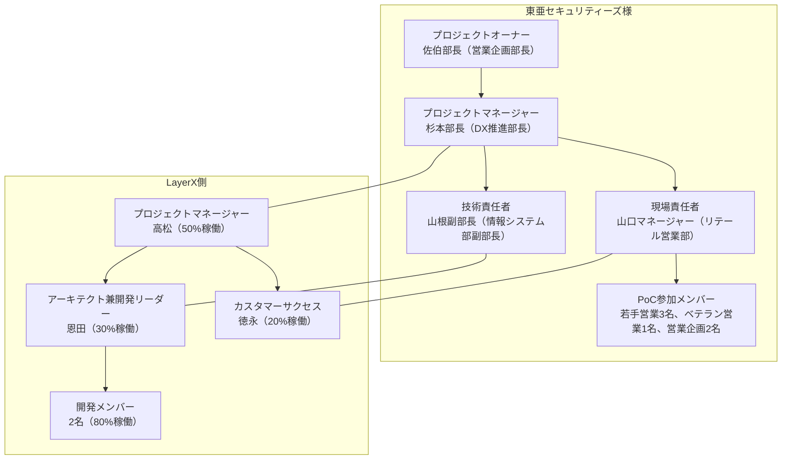

<!--
generated_at: 2026-01-29
generator: docgen skill
source_state:
  - project_state/project_charter.md (updated: 2026-01-18)
  - project_state/wbs.yaml (updated: 2026-01-19)
  - project_state/risks.yaml (updated: 2026-01-20)
  - project_state/decisions.yaml (updated: 2026-01-20)
parent_artifacts:
  - outputs/proposal_draft.md (updated: 2026-01-18)
template: templates/project_plan.md
-->

# 📘 **計画書 テンプレート（Markdown）**

---

# **1. 表紙**

```
# リテール営業部門AI Workforce PoC導入 プロジェクト計画書
## 東亜セキュリティーズ株式会社 御中
### 作成日：2026/01/29
### 作成者：LayerX株式会社
```

---

# **2. 本計画書の目的・位置づけ**

## 2.1 目的

本計画書は、東亜セキュリティーズ株式会社のリテール営業部門へのAI Workforce導入プロジェクト（Phase 1: PoC）について、実行計画を明確化し、プロジェクト関係者間での共通認識を形成することを目的としています。

具体的には以下を定義します：

- プロジェクトのゴールとKPI
- 対象範囲とスコープ
- プロジェクト体制と役割分担
- フェーズ構成と詳細スケジュール
- 技術要件とアーキテクチャ
- リスクと対策
- コミュニケーション・変更管理プロセス

## 2.2 適用範囲

* 対象期間：2026/02 〜 2026/03（Phase 1: PoC実施期間）
* 対象フェーズ：
  - Phase 1: 提案フェーズ（2026年1月中旬～1月末）
  - Phase 2: 計画フェーズ（2026年2月上旬～2月中旬）
  - Phase 3: 設計フェーズ（2026年2月中旬～2月末）
  - Phase 4: 実装フェーズ（2026年3月上旬～3月中旬）
  - Phase 5: テストフェーズ（2026年3月中旬）
  - Phase 6: 効果測定フェーズ（2026年3月下旬）
* 対象部門：リテール営業部門、営業企画部門、DX推進部門、情報システム部門

## 2.3 プロジェクトの背景・解決する課題

### 経営環境の変化

東亜セキュリティーズ様を取り巻く経営環境は大きく変化しています：

- **NISA改正（2024年）**: 個人投資家の参入が急増し、競合証券（ネット証券含む）との競争が激化
- **規制強化**: 金融商品取引法の改正により説明責任が厳格化、エビデンスの根拠明示が必須
- **リテール営業の付加価値**: 競争激化の中、営業担当者の提案品質が問われている
- **若手離職率の上昇**: 提案品質の属人化が原因の一つ

### 提案業務における主な課題

リテール営業部門の提案業務では、以下の3つの主要課題が確認されています：

1. **時間負荷**: 1案件あたり情報検索に30〜60分、資料作成に1〜2時間を要している
2. **心理負荷**: 若手営業担当者は市況解釈や商品選定に自信が持てず、判断に迷っている
3. **属人性**: ベテランと若手で提案品質にばらつきがあり、ノウハウが属人化している

詳細な課題については、提案書「4. 課題認識」をご参照ください。

---

# **3. プロジェクトのゴール・KGI/KPI**

## 3.1 ゴール（定性的）

本プロジェクトのゴールは、AI Workforce導入により、リテール営業部門の提案業務における**品質と生産性を向上**させることです。

具体的には：

- **提案業務の時間短縮**: 情報検索、資料作成の効率化
- **提案品質の底上げ**: 若手でも一定水準の提案が可能に
- **属人性の解消**: ノウハウの組織的共有

## 3.2 KGI（最終的な成果指標の例）

Phase 1（PoC）における最終的な成果指標として、以下を設定します：

| 指標 | 現状 | 目標 | 測定方法 |
|-----|------|------|---------|
| 情報検索時間 | 30-60分/案件 | 10分以内 | PoC参加者のタイムトラッキング |
| 資料作成時間 | 1-2時間/案件 | 30分以内 | PoC参加者のタイムトラッキング |
| 提案品質（上長評価） | 5段階評価で平均3.2 | 平均4.0以上 | 上長による評価（5段階） |
| ユーザー満足度 | - | 80%以上が「有用」と評価 | アンケート（5段階） |

### PoC成功判断基準

効果測定で目標値の50%も達成できない場合はPoC失敗と判断します。ただし、ユーザー満足度が高ければ数値目標未達でも次フェーズ進行の判断もあり得ます（現場の声を重視）。

## 3.3 KPI（プロジェクト進捗指標の例）

プロジェクトの進捗を測定するKPIとして、以下を設定します：

| フェーズ | KPI | 目標値 |
|---------|-----|-------|
| 計画フェーズ | 要件定義書の承認完了 | 2026/02/17まで |
| 設計フェーズ | 設計書（アーキテクチャ、DB、API）の承認完了 | 2026/02/28まで |
| 実装フェーズ | 開発環境・検証環境の構築完了 | 2026/03/03まで |
| 実装フェーズ | データ準備・投入完了（7つのデータソース） | 2026/03/05まで |
| 実装フェーズ | 実装完了・単体テスト完了 | 2026/03/14まで |
| テストフェーズ | UAT完了 | 2026/03/21まで |
| 効果測定フェーズ | 効果測定完了・PoC報告会実施 | 2026/03/31まで |

---

# **4. 対象範囲・スコープ定義**

## 4.1 対象業務

リテール営業部門の提案業務全体を対象とします。

**主要プロセス（6つ）**:
1. 顧客ヒアリング
2. 情報検索
3. 市況整理
4. 商品選定
5. 資料作成
6. 上長レビュー

## 4.2 スコープ（含まれるもの）

Phase 1（PoC）では、以下の3つの領域を対象とします：

### 第一優先：情報検索（ナレッジ統合・要点抽出）
- 10以上のシステム（CRM、商品DB、市況レポートDB、社内規程DB、過去提案資料、FAQ DB、市場ニュース）を横断する統合検索機能
- 支店ローカルに分散している過去提案資料の統合管理
- 検索結果の要点抽出・要約

### 第二優先：市況整理（要約・示唆出し）
- 市況レポートの営業向け要約
- 顧客向け説明への落とし込み支援
- 市況変動ポイントの自動抽出

### 第三優先：提案資料作成（たたき台生成）
- 過去の優良提案事例と最新市況を組み合わせた提案資料のたたき台生成
- テンプレートに沿った出力
- 最新情報の自動反映

### データソース
PoC段階で以下の7つのデータソースを統合します：

| No | システム名 | 内容 | アクセス形態 | データ形式 | 件数 |
|----|-----------|------|-------------|-----------|------|
| 1 | CRM（Salesforce） | 顧客情報、ヒアリングメモ | CSV・マスキング済み | CSV | 約100件 |
| 2 | 商品DB | 投信・株式・債券の商品情報 | JSON | JSON | 約500商品 |
| 3 | 市況レポートDB | 調査部発行の市況レポート | PDF | PDF | 約200本 |
| 4 | 社内規程DB | コンプライアンス規程、営業ガイドライン | PDF/Word | PDF/Word | 約50ドキュメント |
| 5 | 過去提案資料 | 支店ローカル保存の提案資料 | PowerPoint/Word・マスキング済み | PPT/Word | 30-50件 |
| 6 | FAQ DB | 社内Q&A、よくある質問 | CSV | CSV | 約100件 |
| 7 | 市場ニュース（外部） | Bloomberg、日経等の市場データ | LayerXが公開情報取得 | - | - |

すべてのデータは2026年3月5日までに提供予定です。

### PoC参加メンバー
- 若手営業担当者3名
- ベテラン営業1名
- 営業企画メンバー2名
- 合計6名

## 4.3 アウトオブスコープ（含まれないもの）

Phase 1（PoC）では、以下は対象外とします（Phase 2以降で検討）：

- **商品選定支援**: 市況×商品×顧客条件を結びつける判断支援
- **レビュー支援**: 上長レビューの自動化・支援

---

# **5. プロジェクト体制**

## 5.1 体制図（例）

クライアント側とLayerX側の2つのラインを明確に分け、それぞれの縦の関係（上位〜現場）と、同じレイヤー同士の横の関係が分かるように体制図を記載します。



## 5.2 役割と責任（RACI 例）

主要タスクに対して、R（Responsible: 実行責任）/A（Accountable: 説明責任）/C（Consulted: 相談先）/I（Informed: 報告先）を整理します。

| タスク | 佐伯部長 | 杉本部長 | 山根副部長 | 山口マネージャー | PoC参加メンバー | 高松（PM） | 恩田（アーキテクト） | 開発メンバー | 徳永（CS） |
|--------|---------|---------|-----------|----------------|---------------|----------|------------------|------------|----------|
| プロジェクト全体意思決定 | A | C | I | I | I | I | I | I | I |
| 要件定義 | I | A | C | C | I | R | R | I | I |
| システム設計 | I | I | C | I | I | C | R | C | I |
| 開発環境構築 | I | I | C | I | I | C | A | R | I |
| 検証環境構築 | I | C | R | C | I | C | C | I | I |
| データ準備・投入 | I | C | R | R | I | C | C | I | I |
| 実装・テスト | I | I | C | I | I | C | A | R | I |
| UAT実施 | I | I | C | A | R | C | C | I | I |
| 効果測定 | I | C | I | A | R | C | I | I | R |
| PoC報告 | A | C | I | C | I | R | I | I | R |

---

# **6. フェーズ構成とマスタースケジュール**

## 6.1 フェーズ構成（例）

Phase 1（PoC）は、以下の6つのフェーズで構成されます。

| フェーズ | 名称 | 期間 | 概要 |
|----------|------|------|------|
| Phase 1 | 提案フェーズ | 2026/01中旬～01/末 | 提案書作成、レビュー、提出 |
| Phase 2 | 計画フェーズ | 2026/02上旬～02/中旬 | キックオフ、要件定義、要件確定 |
| Phase 3 | 設計フェーズ | 2026/02中旬～02/末 | システム設計、UI/UX設計、データ連携設計、セキュリティ設計 |
| Phase 4 | 実装フェーズ | 2026/03上旬～03/中旬 | 開発環境構築、実装、単体テスト |
| Phase 5 | テストフェーズ | 2026/03中旬 | 統合テスト、セキュリティテスト、UAT |
| Phase 6 | 効果測定フェーズ | 2026/03下旬 | 効果測定、PoC報告書作成、PoC報告会 |

## 6.2 マスタースケジュール（ガントチャートイメージ）

**Phase 1: 提案フェーズ（2026/01中旬～01/末）**
- 1/10-1/28: 提案書作成
- 1/29-1/30: 提案書レビュー・修正
- 1/31: 提案書提出

**Phase 2: 計画フェーズ（2026/02上旬～02/中旬）**
- 2/07: キックオフミーティング準備
- 2/10: キックオフミーティング実施
- 2/11-2/14: 要件定義書作成
- 2/17: 要件確定会議

**Phase 3: 設計フェーズ（2026/02中旬～02/末）**
- 2/18-2/21: システム基本設計、UI/UX設計
- 2/22-2/24: データ連携設計、セキュリティ設計
- 2/28: 設計レビュー会議

**Phase 4: 実装フェーズ（2026/03上旬～03/中旬）**
- 3/01-3/03: 開発環境構築、検証環境構築
- 3/04-3/05: データ準備・投入
- 3/06-3/12: 統合検索機能実装、市況整理機能実装、提案書生成機能実装、UI実装
- 3/13-3/14: 単体テスト

**Phase 5: テストフェーズ（2026/03中旬）**
- 3/15-3/17: 統合テスト、セキュリティテスト
- 3/18: UAT準備
- 3/19-3/21: UAT実施
- 3/22-3/24: 不具合修正

**Phase 6: 効果測定フェーズ（2026/03下旬）**
- 3/21-3/28: 効果測定実施（各メンバー最低3件利用）
- 3/29-3/30: PoC報告書作成
- 3/31: PoC報告会

---

# **7. フェーズ別タスク・成果物**

## 7.1 Phase 1: 提案フェーズ

**期間**: 2026/01中旬～01/末

**主要タスク**:
1. 提案書作成
2. 提案書レビュー・修正
3. 提案書提出

**成果物**:
- 提案書（outputs/proposal_draft.md）

**担当者**:
- 高松（LayerX PM）、恩田（LayerX アーキテクト）

**完了条件**:
- 顧客へ正式提出完了（2026/01/31）
- QualityGate通過

## 7.2 Phase 2: 計画フェーズ

**期間**: 2026/02上旬～02/中旬

**主要タスク**:
1. キックオフミーティング準備
2. キックオフミーティング実施
3. 要件定義書作成
4. 要件確定会議

**成果物**:
- キックオフ資料
- 要件定義書（outputs/requirements_draft.md）

**担当者**:
- 高松（LayerX PM）、恩田（LayerX アーキテクト）、山口マネージャー

**完了条件**:
- 要件定義書の正式承認（2026/02/17）
- 機能要件・非機能要件が明記されている
- 画面遷移図・データフロー図が含まれている
- 顧客レビュー完了

## 7.3 Phase 3: 設計フェーズ

**期間**: 2026/02中旬～02/末

**主要タスク**:
1. システム基本設計
2. UI/UX設計
3. データ連携設計
4. セキュリティ設計
5. 設計レビュー会議

**成果物**:
- 設計書（アーキテクチャ図、DB設計、API設計）
- 画面設計書、ワイヤーフレーム
- データ連携仕様書
- セキュリティ設計書

**担当者**:
- 恩田（LayerX アーキテクト）、開発メンバー2名、山根副部長

**完了条件**:
- 設計書の正式承認（2026/02/28）
- システム構成図、データモデル、API仕様書作成完了
- 7つのデータソースとの連携方式確定
- 認証・認可の実装方針確定、暗号化方式確定、監査ログ設計完了

## 7.4 Phase 4: 実装フェーズ

**期間**: 2026/03上旬～03/中旬

**主要タスク**:
1. 開発環境構築
2. 検証環境構築
3. データ準備・投入
4. 統合検索機能実装
5. 市況整理機能実装
6. 提案書生成機能実装
7. UI実装
8. 単体テスト

**成果物**:
- 開発環境
- 検証環境
- マスキング済みテストデータ
- 実装済み機能（統合検索、市況整理、提案書生成、UI）

**担当者**:
- 開発メンバー2名、恩田（LayerX アーキテクト）、山根副部長、山口マネージャー

**完了条件**:
- Azure環境セットアップ完了（2026/03/03）
- 顧客側検証環境準備完了（2026/03/03）
- 7つのデータソース取り込み完了（2026/03/05）
- 統合検索、市況整理、提案書生成、UI実装完了（2026/03/12）
- 単体テスト完了、カバレッジ80%以上（2026/03/14）

## 7.5 Phase 5: テストフェーズ

**期間**: 2026/03中旬

**主要タスク**:
1. 統合テスト
2. セキュリティテスト
3. UAT準備
4. UAT実施
5. 不具合修正

**成果物**:
- UATシナリオ、テストケース
- テスト完了報告

**担当者**:
- 開発メンバー2名、恩田（LayerX アーキテクト）、山根副部長、高松（LayerX PM）、山口マネージャー、PoC参加メンバー6名

**完了条件**:
- 機能間連携テスト完了（2026/03/17）
- 脆弱性診断完了（2026/03/17）
- 3つのユースケースのテスト完了（2026/03/21）
- 致命的不具合がないことを確認
- UAT指摘事項の修正完了、再テスト完了（2026/03/24）

## 7.6 Phase 6: 効果測定フェーズ

**期間**: 2026/03下旬

**主要タスク**:
1. 効果測定実施
2. PoC報告書作成
3. PoC報告会

**成果物**:
- 効果測定レポート
- PoC報告書

**担当者**:
- PoC参加メンバー6名、山口マネージャー、高松（LayerX PM）、徳永（LayerX CS）

**完了条件**:
- 効果測定完了（2026/03/28）
  - 情報検索時間の測定（目標: 10分以内）
  - 資料作成時間の測定（目標: 30分以内）
  - 提案品質の評価（目標: 平均4.0以上）
  - ユーザー満足度アンケート実施（目標: 80%以上）
- PoC報告書作成完了（2026/03/30）
- PoC報告会実施完了（2026/03/31）
- Phase 2移行判断の合意

---

# **8. 環境構成・技術要件**

## 8.1 インフラ構成要件（例）

### PoC段階（Phase 1）

**クラウド基盤**: Microsoft Azure（Japan East）
**ネットワーク**: VPN経由でのセキュアな接続
**コンピュート**: Azure App Service（PaaS）
**ストレージ**: Azure Blob Storage（市況レポート、過去提案資料）、Azure Files（ドキュメント管理）
**セキュリティ**: Azure Key Vault（シークレット管理）、Azure AD（認証）

### 本番環境（Phase 2以降）

**クラウド基盤**: Microsoft Azure（専用Subscription）
**ネットワーク**: VNET分離、PrivateLink経由での既存システム接続
**可用性**: 99.9%以上の可用性を目標
**バックアップ**: 日次バックアップ、7日間保持
**DR（災害復旧）**: RPO 24時間、RTO 48時間

## 8.2 アプリケーション構成要件

### AI Workforce の構成要素

**Webアプリ**: Azure App Service（React + TypeScript）
**API**: Azure Functions（Node.js/Python）
**ワークフローエンジン**: カスタム実装（Azure Functions + Azure Logic Apps）
**ナレッジポータル**: Azure AI Search

### 利用するAzure AIサービス

**Azure OpenAI Service（GPT-4o）**:
- 自然言語理解、対話処理
- 文書生成、要約
- プロンプトエンジニアリング

**Azure AI Document Intelligence**:
- PDF、Word、Excel、PowerPointの読解・構造化
- テーブル抽出、キーバリュー抽出

**Azure AI Search**:
- ベクター検索（セマンティック検索）
- キーワード検索（全文検索）
- ハイブリッド検索（キーワード + ベクター）

### データ連携

**PoC段階**: ファイル取り込み方式（CSV、JSON、PDF等のアップロード）
**本番環境**: API連携方式（REST API、Azure Function等を活用）

## 8.3 非機能要件

### 可用性・性能要件

**可用性**: 99.9%以上（年間ダウンタイム8.76時間以内）
**応答時間**:
- 検索クエリ: 3秒以内
- 文書生成: 30秒以内（提案資料のたたき台）
**同時接続数**: 20名（PoC段階）、200名（本格展開時）

### バックアップ/DR方針

**バックアップ**:
- データベース: 日次バックアップ、7日間保持
- ファイルストレージ: 日次バックアップ、30日間保持

**DR（災害復旧）**:
- RPO（目標復旧時点）: 24時間
- RTO（目標復旧時間）: 48時間

### 監視・アラート要件

**監視対象**:
- システム稼働率、応答時間
- エラー率、例外発生率
- リソース使用率（CPU、メモリ、ストレージ）

**アラート**:
- システムダウン: 即時アラート（Slack/メール）
- 応答時間超過: 警告アラート
- エラー率上昇: 警告アラート

---

# **9. ナレッジ・データ準備計画**

## 9.1 対象ナレッジの洗い出し

Phase 1（PoC）では、以下の7つのデータソースからナレッジを収集します：

1. **CRM（Salesforce）**: 顧客情報、ヒアリングメモ（CSV、約100件、マスキング済み）
2. **商品DB**: 投信・株式・債券の商品情報（JSON、約500商品）
3. **市況レポートDB**: 調査部発行の市況レポート（PDF、約200本）
4. **社内規程DB**: コンプライアンス規程、営業ガイドライン（PDF/Word、約50ドキュメント）
5. **過去提案資料**: 支店ローカル保存の提案資料（PowerPoint/Word、30-50件、マスキング済み）
6. **FAQ DB**: 社内Q&A、よくある質問（CSV、約100件）
7. **市場ニュース（外部）**: Bloomberg、日経等の市場データ（LayerXが公開情報取得）

すべてのデータは2026年3月5日までに東亜セキュリティーズ様より提供予定です。

## 9.2 データ整備・クレンジング

### データクレンジング計画

データ品質問題（欠損、不整合、粒度のばらつき）を最小化するため、以下のクレンジング工程を設けます：

**クレンジング項目**:
- 重複データの削除
- 欠損フィールドの補完または除外
- フォーマット統一（日付、金額、商品コード等）
- 文字コード統一（UTF-8）
- 不適切データの除外（個人情報漏洩リスクのあるデータ等）

**クレンジング手順**:
1. データ品質チェックリストを作成し、提供前に確認
2. LayerX側でクレンジングツールを用いて自動チェック
3. 問題データは除外してPoC実施
4. クレンジング結果を東亜セキュリティーズ様に報告

### マスキング処理

PoC段階では、個人情報保護法に準拠し、以下のマスキング処理を実施します：

- 顧客氏名: 仮名化（例: 顧客A、顧客B）
- 顧客住所: 都道府県レベルまで（例: 東京都）
- 電話番号: マスキング（例: 03-XXXX-XXXX）
- 口座番号: マスキング
- 資産額: 範囲化（例: 5,000万円～1億円）

## 9.3 ナレッジポータルへの登録・更新フロー

### 初期登録フロー

1. 東亜セキュリティーズ様からデータ提供（2026/03/05まで）
2. LayerX側でデータクレンジング・マスキング処理
3. Azure AI Document Intelligenceで文書構造化
4. Azure AI Searchへインデックス登録
5. 検証環境で検索テスト実施

### 更新フロー（Phase 2以降）

1. 新規データ発生（市況レポート、提案資料等）
2. データ連携（API連携またはファイルアップロード）
3. 自動クレンジング・構造化
4. Azure AI Searchへ自動インデックス更新
5. 定期的なインデックス最適化

---

# **10. セキュリティ・ガバナンス計画**

## 10.1 アクセス制御・権限設計

### 認証方式（SSO等）

**Azure AD SSO連携**: 東亜セキュリティーズ様の既存Azure ADと連携し、シングルサインオンを実現
**多要素認証（MFA）**: オプションでMFAを有効化し、セキュリティを強化

### 部門・ロールごとの閲覧・実行権限

**ロールベースアクセス制御（RBAC）**:

| ロール | 対象部門 | 権限 |
|--------|---------|------|
| 営業ユーザー | リテール営業部門 | 提案資料作成、情報検索、市況整理 |
| 営業企画ユーザー | 営業企画部門 | 全機能アクセス + 管理機能（ナレッジ登録、FAQ編集） |
| 情シスユーザー | 情報システム部門 | システム管理、監査ログ閲覧、ユーザー管理 |
| PoC参加メンバー | PoC参加者6名 | 営業ユーザー権限 + フィードバック機能 |

**最小権限の原則**: ユーザーは必要最小限の権限のみ付与

## 10.2 ログ・監査対応

### 操作ログ・エージェント実行ログの取得と保管

**ログ取得対象**:
- ログイン・ログアウト
- 検索クエリ（検索キーワード、検索結果）
- 文書生成（生成内容、使用テンプレート、引用元）
- データアクセス（閲覧・ダウンロード）
- 設定変更（ユーザー追加、権限変更等）

**ログ保存期間**: 6ヶ月保存
**ログ形式**: JSON形式、Azure Log Analyticsに保存

### 監査対応時のログ検索・エクスポート手順

1. Azure Log Analyticsで検索クエリを実行
2. 該当ログを抽出（期間、ユーザー、操作種別等で絞り込み）
3. CSV形式でエクスポート
4. 監査担当者へ提供

## 10.3 AI リスク管理

### 幻覚対策（根拠提示、RAG利用）

**根拠提示型RAG（Retrieval-Augmented Generation）**:
- AI生成文書には、引用元（市況レポート、過去提案等）を明示
- 出典ドキュメントへのリンクを提供
- ユーザーがファクトチェック可能

**ガードレール設定**:
- 禁止ワード設定（不適切な表現、誇大広告等を検出・ブロック）
- コンプライアンスチェック（金融商品取引法、個人情報保護法等への準拠を確認）

### レビュー・承認フローの運用

**上長レビュー必須**: AI生成資料は必ず上長レビューを経てから顧客提出
**承認ワークフロー**: 重要度に応じた承認フローを設定
- 軽微な修正: 上長レビューのみ
- 重要な提案: 上長 → 営業企画部長承認

---

# **11. コミュニケーション・変更管理**

## 11.1 コミュニケーション計画

### 定例会（ステアリングコミッティ/PJ定例）の頻度・参加者

**週次定例会議**:
- 頻度: 毎週火曜 15:00-16:00
- 参加者:
  - 東亜セキュリティーズ様: 杉本部長（PM）、山根副部長、山口マネージャー
  - LayerX: 高松（PM）、恩田（アーキテクト）
- 議題: 進捗報告、課題共有、意思決定

**月次ステアリングコミッティ**（Phase 2以降）:
- 頻度: 月次
- 参加者:
  - 東亜セキュリティーズ様: 佐伯部長（オーナー）、杉本部長（PM）、山根副部長
  - LayerX: 高松（PM）
- 議題: プロジェクト全体進捗、重要意思決定、リスク報告

### 共有資料・議事録の管理方法

**ドキュメント共有**: SharePoint
**議事録管理**:
- 週次定例会議の議事録をSharePointに保存
- 決定事項はproject_state/decisions.yamlに記録
- 課題はBacklogに起票

**日次コミュニケーション**: Slackチャネル（デイリー進捗報告）
**緊急連絡**: Slack/電話

## 11.2 変更管理プロセス

### スコープ変更・要件変更の申請〜承認フロー

**変更管理フロー**:

1. **変更申請**: Backlogでチケット起票
2. **影響分析**: PM + アーキテクトで影響範囲を分析（スケジュール、コスト、リスク）
3. **承認判断**:
   - 軽微な変更（1日以内の工数）: PM判断で承認
   - 大きな変更（1週間以上の工数、スコープ変更）: 両社PM協議の上、承認
4. **記録**: 承認された変更はproject_state/change_log.yamlに記録
5. **実施**: 変更内容を実装・テスト
6. **完了報告**: 週次定例会議で報告

### 影響分析・リスク評価の進め方

**影響分析項目**:
- スケジュール影響（遅延日数）
- コスト影響（追加工数）
- スコープ影響（他機能への影響）
- リスク影響（新たなリスクの発生）

**リスク評価**:
- 変更に伴うリスクをproject_state/risks.yamlに追加
- リスク対策を策定し、週次定例会議で共有

---

# **12. リスクと対策**

## 12.1 想定リスク

Phase 1（PoC）では、以下のリスクを識別しています：

| リスク | 影響度 | 発生確率 | スコア |
|--------|--------|---------|--------|
| 現場の抵抗によるPoC失敗リスク | 高 | 中 | 6 |
| データソースの統合困難リスク | 中 | 中 | 4 |
| セキュリティ制約によるデータ連携制限リスク | 高 | 中 | 6 |
| PoC参加メンバーの業務負荷リスク | 中 | 中 | 4 |
| 本格導入時のシステム連携複雑性リスク | 中 | 中 | 4 |
| 過去提案資料統合の遅延リスク | 低 | 中 | 2 |
| データ品質問題によるAI精度低下 | 高 | 中 | 6 |
| AI精度不足によるPoC価値低下 | 高 | 中 | 6 |
| スケジュール遅延リスク | 中 | 中 | 4 |

## 12.2 リスク別対策案

### 現場の抵抗によるPoC失敗リスク

**内容**: 現場メンバーがAI導入に抵抗感を示し、PoCへの協力が得られずに失敗する可能性がある

**早期兆候**:
- PoC参加メンバーの選定が進まない
- 現場からの懸念や不満の声が上がる
- PoC利用率が低い

**予防策**:
- 現場が「使ってみたい」と思える領域に絞る
- PoC評価軸として「現場の抵抗が少ない」を重視
- 段階的導入により、急激な変化を避ける

**発生時対応**:
- PoC対象領域を再検討
- 現場との対話を強化し、懸念を解消

### データソースの統合困難リスク

**内容**: 複数のデータソース（10以上のシステム）を統合する際に、技術的困難や制約により統合が進まない可能性がある

**早期兆候**:
- データソース一覧の確定が遅延
- 技術調査で統合困難なシステムが判明
- データ連携のAPI提供が難しいと判明

**予防策**:
- データソース一覧の早期確定
- 技術調査の実施
- 段階的に統合対象を拡大

**発生時対応**:
- 統合困難なデータソースは対象外とし、優先度の高いものに絞る
- 代替手段（手動入力、ファイル取り込みなど）を検討

### セキュリティ制約によるデータ連携制限リスク

**内容**: データ連携やセキュリティ制約により、必要なデータへのアクセスが制限され、PoC機能が制限される可能性がある

**早期兆候**:
- セキュリティ制約の確認が遅延
- 情シスからデータ連携に関する制約が多数提示される
- データアクセス権限の取得が困難

**予防策**:
- 早期にセキュリティ要件を確認
- 情シスとの密な連携
- セキュリティ対策を考慮したアーキテクチャ設計

**発生時対応**:
- 制約の範囲内でPoC機能を再設計
- 代替データソースの検討
- 段階的なアクセス権限の拡大を交渉

### PoC参加メンバーの業務負荷リスク

**内容**: PoC参加メンバーが本業との両立で負荷過多となり、PoC参加率が低下する可能性

**早期兆候**:
- PoC参加率が低い
- 本業多忙を理由とした辞退

**予防策**:
- 本業との兼ね合いを事前調整
- 業務時間内でのPoC実施を推奨

**発生時対応**:
- 参加メンバーの追加募集
- PoC期間の延長検討

### 本格導入時のシステム連携複雑性リスク

**内容**: 本格導入時のCRM、商品DB等とのAPI連携が複雑で、予定通り進まない可能性

**早期兆候**:
- API仕様の確認に時間がかかる
- データ連携テストで不具合発生

**予防策**:
- PoC段階でAPI連携の技術検証を実施
- 情シスとの早期連携

**発生時対応**:
- ファイル取り込み方式での代替運用
- 連携対象システムの優先順位付け

### 過去提案資料統合の遅延リスク

**内容**: 支店ごとに分散している過去提案資料の統合に想定以上の時間がかかり、本格導入が遅れる可能性

**早期兆候**:
- サンプル提供が遅延
- 資料フォーマットが不統一で整理に時間がかかる

**予防策**:
- PoC段階で統合作業の工数を見積もる
- 段階的に統合対象を拡大

**発生時対応**:
- Phase 2では限定的な資料のみ統合
- 本格展開時に全社統合

### データ品質問題によるAI精度低下

**内容**: 提供されるデータの品質（欠損、不整合、粒度のばらつき）が悪く、AI精度が目標に達しない可能性

**早期兆候**:
- データクレンジング時に品質問題が多数検出
- テスト時にAI出力品質が低い

**予防策**:
- データクレンジング工程を設計フェーズに追加
- データ品質チェックリストを作成し、提供前に確認
- 問題データは除外してPoC実施

**発生時対応**:
- データ品質が改善されるまでPoC対象範囲を縮小
- クレンジング工程を追加で実施

### AI精度不足によるPoC価値低下

**内容**: プロンプトエンジニアリングが不十分で、AI出力の精度が目標に達せず、PoC価値が低下する可能性

**早期兆候**:
- テスト期間中のAI出力品質が低い
- ユーザーからの精度不満の声が多い

**予防策**:
- プロンプトエンジニアリングに十分な時間を確保
- テスト期間中に精度改善のイテレーションを実施
- Azure OpenAI Service（GPT-4o）の最新機能を活用

**発生時対応**:
- 最悪の場合、機能範囲を縮小してリリース
- ユーザーフィードバックをもとに段階的に改善

### スケジュール遅延リスク

**内容**: 各フェーズで想定外の問題が発生し、スケジュールが遅延してPoC報告会（2026/03/31）に間に合わない可能性

**早期兆候**:
- 週次進捗会議で遅延の兆候検出
- クリティカルパスのタスクが遅延

**予防策**:
- 週次進捗会議で早期検知
- バッファ期間を各フェーズに設定（3-5日）
- 優先度の低い機能は次フェーズに先送り

**発生時対応**:
- スコープ調整（優先度低機能の削除）
- リソース追加の検討
- PoC期間の延長交渉

---

**以上**
