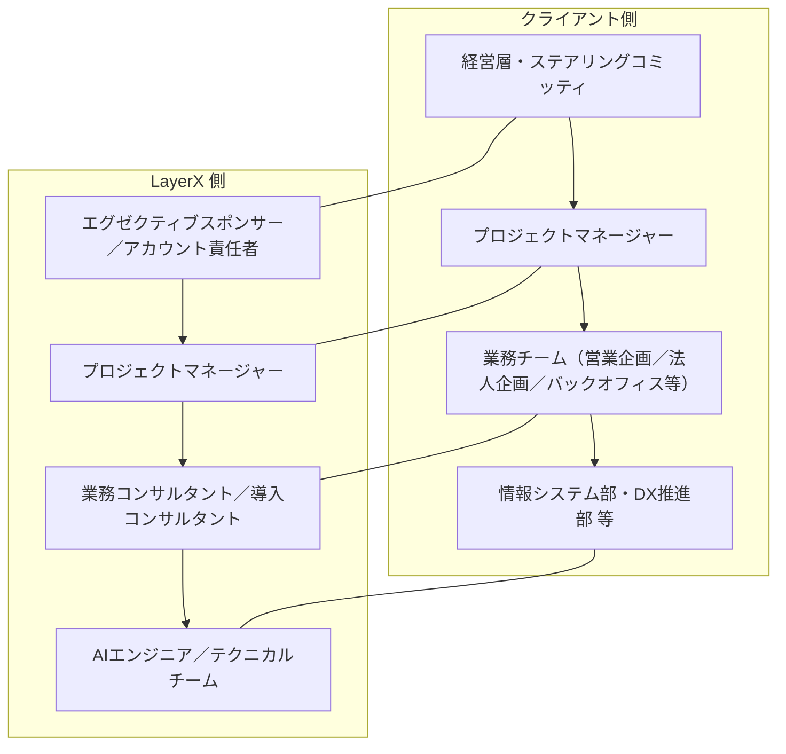

<!--
FILE_NAME: 計画書_YYYYMMDD.md
DESCRIPTION: 実行計画・プロジェクト計画書テンプレート
PURPOSE: 本テンプレートに基づきAIが計画書を生成する際の標準ファイル名となる
-->

# 📘 **計画書 テンプレート（Markdown）**

---

# **1. 表紙**

```
# XXX計画書
## （クライアント名）様向け
### 作成日：YYYY/MM/DD
### 作成者：（貴社名／プロジェクト名）
```

---

# **2. 本計画書の目的・位置づけ**

## 2.1 目的

## 2.2 適用範囲

* 対象期間：YYYY/MM 〜 YYYY/MM
* 対象フェーズ：
* 対象部門：XXXX

## 2.3 プロジェクトの背景・解決する課題

---

# **3. プロジェクトのゴール・KGI/KPI**

## 3.1 ゴール（定性的）

## 3.2 KGI（最終的な成果指標の例）

## 3.3 KPI（プロジェクト進捗指標の例）

---

# **4. 対象範囲・スコープ定義**

## 4.1 対象業務

## 4.2 スコープ（含まれるもの）

## 4.3 アウトオブスコープ（含まれないもの）

---

# **5. プロジェクト体制**

## 5.1 体制図（例）

* クライアント側と LayerX 側の **2つのライン** を明確に分け、それぞれの縦の関係（上位〜現場）と、同じレイヤー同士の横の関係が分かるように体制図を記載します。
* 以下は、Mermaid 記法を用いた体制図の例です（実際のプロジェクトに合わせてノード名・関係線を編集してください）。  
  **左側にクライアント、右側に LayerX** を横並びに配置し、それぞれの中では縦方向に体制を表現します（クライアントと LayerX の間に上下関係はありません）。



## 5.2 役割と責任（RACI 例）

* 要件定義、ナレッジ整理、ワークフロー設計、環境構築、テスト、教育・展開などの  
  タスクに対して、R（Responsible）/A（Accountable）/C（Consulted）/I（Informed）を整理。

---

# **6. フェーズ構成とスケジュール**

## 6.1 フェーズ構成（例）

例として、以下のようなフェーズ構成を想定します（実際のプロジェクトに合わせて編集してください）。

| フェーズ  | 名称                       | 概要                                               |
|----------|----------------------------|----------------------------------------------------|
| フェーズ0 | 準備・キックオフ           | 体制構築、ユースケース候補整理、プロジェクト計画の策定 |
| フェーズ1 | PoC 設計・実行             | PoC 対象設計、環境構築、検証用ワークフロー実装と効果測定 |
| フェーズ2 | 本番導入設計               | 本番スコープ確定、アーキテクチャ設計、運用・ガバナンス設計 |
| フェーズ3 | 本番環境構築・移行         | 本番環境構築、データ・ナレッジ移行、受入テスト・稼働確認   |
| フェーズ4 | スケール展開・定着化       | 利用部門拡大、トレーニング、改善サイクル・定着化施策の実施 |

## 6.2 マスタースケジュール（ガントチャートイメージ）

* 月次・週次単位での主要マイルストーンを定義
* 例：

```
Month 1：キックオフ・要件整理・環境準備  
Month 2：PoC 構築・内部テスト  
Month 3：ユーザーテスト・効果測定・本番導入計画確定  
Month 4〜：本番構築・移行・トレーニング・スケール展開
```

---

# **7. フェーズ別タスク・成果物**

## 7.1 フェーズ0：準備・キックオフ

## 7.2 フェーズ1：PoC 設計・実行


## 7.3 フェーズ2：本番導入設計

## 7.4 フェーズ3：本番環境構築・移行

## 7.5 フェーズ4：スケール展開・定着化

---

# **8. 環境構成・技術要件**

## 8.1 インフラ構成要件（例）

* クラウド基盤：Microsoft Azure
* ネットワーク：VPN／PrivateLink／閉域構成
* コンピュート・ストレージ要件

## 8.2 アプリケーション構成要件

* AIWorkforce の構成要素（Webアプリ、API、ワークフローエンジン等）
* 利用する Azure AI サービス（Azure OpenAI, Document Intelligence, AI Search 等）

## 8.3 非機能要件

* 可用性・性能要件
* バックアップ／DR 方針
* 監視・アラート要件

---

# **9. ナレッジ・データ準備計画**

## 9.1 対象ナレッジの洗い出し


## 9.2 データ整備・クレンジング


## 9.3 ナレッジポータルへの登録・更新フロー

---

# **10. セキュリティ・ガバナンス計画**

## 10.1 アクセス制御・権限設計

* 認証方式（SSO 等）
* 部門・ロールごとの閲覧・実行権限

## 10.2 ログ・監査対応

* 操作ログ・エージェント実行ログの取得と保管
* 監査対応時のログ検索・エクスポート手順

## 10.3 AI リスク管理

* 幻覚対策（根拠提示、RAG 利用）
* レビュー・承認フローの運用

---

# **11. コミュニケーション・変更管理**

## 11.1 コミュニケーション計画

* 定例会（ステアリングコミッティ／PJ定例）の頻度・参加者
* 共有資料・議事録の管理方法

## 11.2 変更管理プロセス

* スコープ変更・要件変更の申請〜承認フロー
* 影響分析・リスク評価の進め方

---

# **12. リスクと対策**

## 12.1 想定リスク


## 12.2 リスク別対策案


---