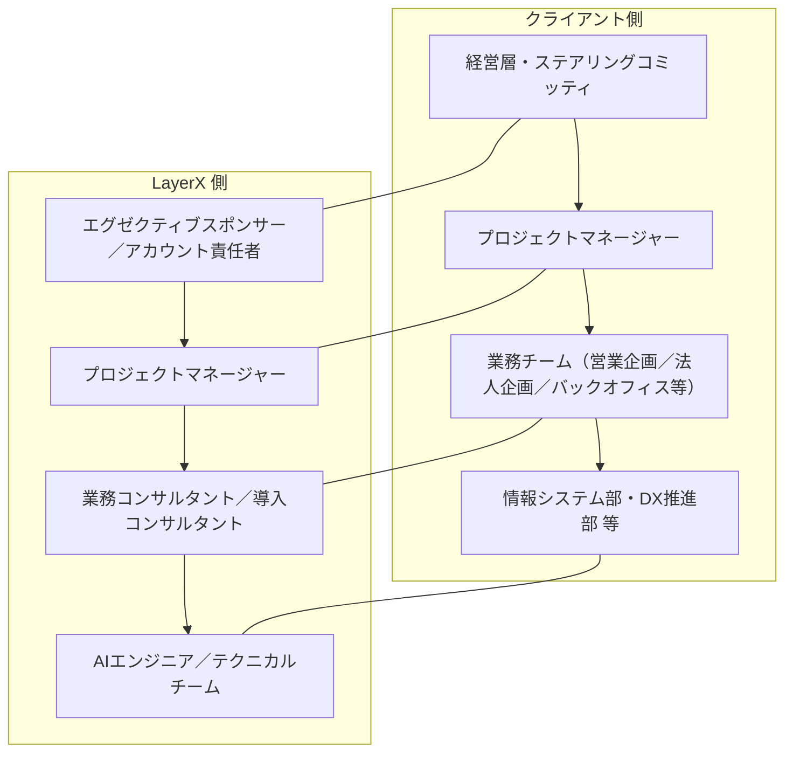
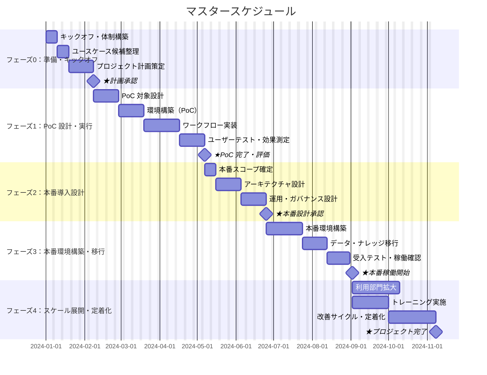

<!--
FILE_NAME: 計画書_YYYYMMDD.md
DESCRIPTION: 実行計画・プロジェクト計画書テンプレート
PURPOSE: 本テンプレートに基づきAIが計画書を生成する際の標準ファイル名となる
-->

# 📘 **計画書 テンプレート（Markdown）**

---

# **1. 表紙**

```
# XXX計画書
## （クライアント名）様向け
### 作成日：YYYY/MM/DD
### 作成者：（貴社名／プロジェクト名）
```

---

# **2. 本計画書の目的・位置づけ**

## 2.1 目的

## 2.2 適用範囲

* 対象期間：YYYY/MM 〜 YYYY/MM
* 対象フェーズ：
* 対象部門：XXXX

## 2.3 プロジェクトの背景・解決する課題

---

# **3. プロジェクトのゴール・KGI/KPI**

## 3.1 ゴール（定性的）

## 3.2 KGI（最終的な成果指標の例）

## 3.3 KPI（プロジェクト進捗指標の例）

---

# **4. 対象範囲・スコープ定義**

## 4.1 対象業務

## 4.2 スコープ（含まれるもの）

## 4.3 アウトオブスコープ（含まれないもの）

---

# **5. プロジェクト体制**

## 5.1 体制図

* クライアント側と LayerX 側の **2つのライン** を明確に分け、それぞれの縦の関係（上位〜現場）と、同じレイヤー同士の横の関係が分かるように体制図を記載します。
* 以下は、Mermaid 記法を用いた体制図の例です（実際のプロジェクトに合わせてノード名・関係線を編集してください）。  
  **左側にクライアント、右側に LayerX** を横並びに配置し、それぞれの中では縦方向に体制を表現します（クライアントと LayerX の間に上下関係はありません）。


```mermaid
graph TD
  %% クライアント側（左カラム）
  subgraph Client[クライアント側]
    C_EX[経営層・ステアリングコミッティ]
    C_PM[プロジェクトマネージャー]
    C_BIZ[業務チーム（営業企画／法人企画／バックオフィス等）]
    C_IT[情報システム部・DX推進部 等]
    
    C_EX --> C_PM --> C_BIZ --> C_IT
  end

  %% LayerX 側（右カラム）
  subgraph LX[LayerX 側]
    L_EX[エグゼクティブスポンサー／アカウント責任者]
    L_PM[プロジェクトマネージャー]
    L_CONS[業務コンサルタント／導入コンサルタント]
    L_ENG[AIエンジニア／テクニカルチーム]
    
    L_EX --> L_PM --> L_CONS --> L_ENG
  end

  %% 横の関係（同じレイヤー同士を連携させて横並びを維持）
  %% ※ Mermaidではリンクで繋ぐとランクが揃いやすくなります
  C_EX --- L_EX
  C_PM --- L_PM
  C_BIZ --- L_CONS
  C_IT --- L_ENG
```

## 5.2 役割と責任（RACI）

* 要件定義、ナレッジ整理、ワークフロー設計、環境構築、テスト、教育・展開などの  
  タスクに対して、R（Responsible）/A（Accountable）/C（Consulted）/I（Informed）を整理。

---

# **6. フェーズ構成とマスタースケジュール**

## 6.1 フェーズ構成

例として、以下のようなフェーズ構成を想定します（実際のプロジェクトに合わせて編集してください）。

| フェーズ  | 名称                       | 概要                                               |
|----------|----------------------------|----------------------------------------------------|
| フェーズ0 | 準備・キックオフ           | 体制構築、ユースケース候補整理、プロジェクト計画の策定 |
| フェーズ1 | PoC 設計・実行             | PoC 対象設計、環境構築、検証用ワークフロー実装と効果測定 |
| フェーズ2 | 本番導入設計               | 本番スコープ確定、アーキテクチャ設計、運用・ガバナンス設計 |
| フェーズ3 | 本番環境構築・移行         | 本番環境構築、データ・ナレッジ移行、受入テスト・稼働確認   |
| フェーズ4 | スケール展開・定着化       | 利用部門拡大、トレーニング、改善サイクル・定着化施策の実施 |

## 6.2 マスタースケジュール（ガントチャート）

* 月次・週次単位での主要マイルストーンを定義
* フェーズ間の依存関係と並行作業を可視化


```mermaid
gantt
    title マスタースケジュール
    dateFormat YYYY-MM-DD
    excludes weekends

    section フェーズ0：準備・キックオフ
    キックオフ・体制構築           :p0-1, 2024-01-01, 1w
    ユースケース候補整理           :p0-2, after p0-1, 1w
    プロジェクト計画策定           :p0-3, after p0-2, 2w
    ★計画承認                     :milestone, m0, after p0-3, 0d

    section フェーズ1：PoC 設計・実行
    PoC 対象設計                   :p1-1, after m0, 2w
    環境構築（PoC）                :p1-2, after p1-1, 2w
    ワークフロー実装               :p1-3, after p1-2, 3w
    ユーザーテスト・効果測定       :p1-4, after p1-3, 2w
    ★PoC 完了・評価               :milestone, m1, after p1-4, 0d

    section フェーズ2：本番導入設計
    本番スコープ確定               :p2-1, after m1, 1w
    アーキテクチャ設計             :p2-2, after p2-1, 2w
    運用・ガバナンス設計           :p2-3, after p2-2, 2w
    ★本番設計承認                 :milestone, m2, after p2-3, 0d

    section フェーズ3：本番環境構築・移行
    本番環境構築                   :p3-1, after m2, 3w
    データ・ナレッジ移行           :p3-2, after p3-1, 2w
    受入テスト・稼働確認           :p3-3, after p3-2, 2w
    ★本番稼働開始                 :milestone, m3, after p3-3, 0d

    section フェーズ4：スケール展開・定着化
    利用部門拡大                   :p4-1, after m3, 4w
    トレーニング実施               :p4-2, after m3, 3w
    改善サイクル・定着化           :p4-3, after p4-2, 4w
    ★プロジェクト完了             :milestone, m4, after p4-3, 0d
```

**凡例：**
- `★` マイルストーン（承認・レビューポイント）
- 日付・期間は実際のプロジェクトに合わせて編集してください
- `excludes weekends` を削除すると土日も含めたスケジュールになります

---

# **7. フェーズ別タスク・成果物**

| フェーズ | タスク | 成果物 | 担当 | 備考 |
|---------|--------|--------|------|------|
| **フェーズ0：準備・キックオフ** | キックオフ会議実施 | キックオフ議事録 | 両社 | |
| | 体制構築・役割定義 | 体制図、RACI表 | 両社 | |
| | ユースケース候補整理 | ユースケース一覧 | クライアント／LayerX | |
| | プロジェクト計画策定 | プロジェクト計画書 | LayerX | 本書 |
| **フェーズ1：PoC 設計・実行** | PoC 対象業務選定 | PoC 設計書 | 両社 | |
| | PoC 環境構築 | 環境構築完了報告 | LayerX | |
| | ワークフロー実装 | ワークフロー定義書 | LayerX | |
| | ナレッジ登録（PoC用） | ナレッジ一覧 | クライアント／LayerX | |
| | ユーザーテスト実施 | テスト結果報告書 | 両社 | |
| | 効果測定・評価 | PoC 評価レポート | LayerX | |
| **フェーズ2：本番導入設計** | 本番スコープ確定 | スコープ定義書 | 両社 | |
| | アーキテクチャ設計 | アーキテクチャ設計書 | LayerX | |
| | 運用設計 | 運用設計書 | LayerX | |
| | ガバナンス設計 | ガバナンス方針書 | 両社 | |
| | セキュリティ設計 | セキュリティ設計書 | LayerX | |
| **フェーズ3：本番環境構築・移行** | 本番環境構築 | 環境構築完了報告 | LayerX | |
| | データ移行 | データ移行報告書 | 両社 | |
| | ナレッジ移行 | ナレッジ移行完了報告 | 両社 | |
| | 受入テスト | 受入テスト報告書 | クライアント | |
| | 稼働判定 | 稼働判定書 | 両社 | |
| **フェーズ4：スケール展開・定着化** | 利用部門拡大計画 | 展開計画書 | 両社 | |
| | トレーニング実施 | トレーニング資料、実施報告 | LayerX | |
| | 運用開始・サポート | 運用マニュアル | LayerX | |
| | 改善サイクル運用 | 改善提案レポート | LayerX | 継続的 |
| | 定着化施策実施 | 定着化レポート | 両社 | |

**補足：**
- 「担当」欄は主担当を記載。詳細な役割分担はRACIを参照
- 成果物の詳細フォーマットは別途定義

---

# **8. 環境構成・技術要件**

## 8.1 インフラ構成要件

* クラウド基盤：Microsoft Azure
* ネットワーク：VPN／PrivateLink／閉域構成
* コンピュート・ストレージ要件

## 8.2 アプリケーション構成要件

* AIWorkforce の構成要素（Webアプリ、API、ワークフローエンジン等）
* 利用する Azure AI サービス（Azure OpenAI, Document Intelligence, AI Search 等）

## 8.3 非機能要件

* 可用性・性能要件
* バックアップ／DR 方針
* 監視・アラート要件

---

# **9. ナレッジ・データ準備計画**

## 9.1 対象ナレッジの洗い出し


## 9.2 データ整備・クレンジング


## 9.3 ナレッジポータルへの登録・更新フロー

---

# **10. セキュリティ・ガバナンス計画**

## 10.1 アクセス制御・権限設計

* 認証方式（SSO 等）
* 部門・ロールごとの閲覧・実行権限

## 10.2 ログ・監査対応

* 操作ログ・エージェント実行ログの取得と保管
* 監査対応時のログ検索・エクスポート手順

## 10.3 AI リスク管理

* 幻覚対策（根拠提示、RAG 利用）
* レビュー・承認フローの運用

---

# **11. コミュニケーション・変更管理**

## 11.1 コミュニケーション計画

* 定例会（ステアリングコミッティ／PJ定例）の頻度・参加者
* 共有資料・議事録の管理方法

## 11.2 変更管理プロセス

* スコープ変更・要件変更の申請〜承認フロー
* 影響分析・リスク評価の進め方

---

# **12. リスクと対策**

## 12.1 想定リスク


## 12.2 リスク別対策案


---